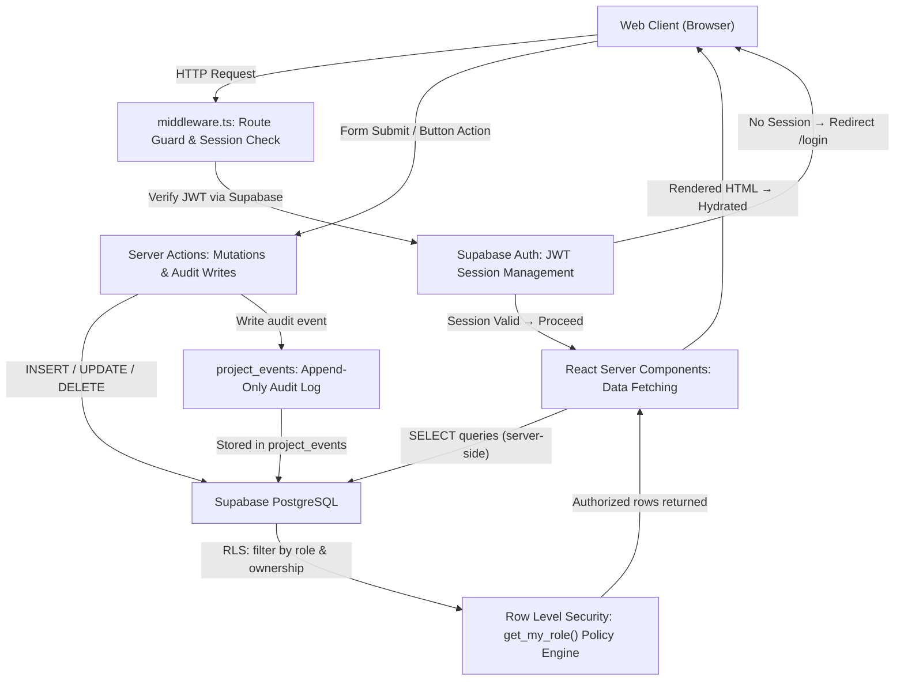
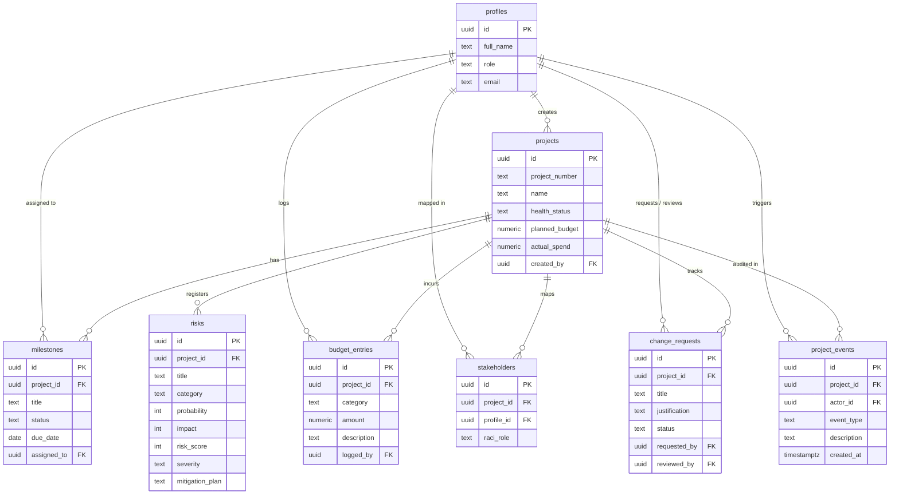

# ProjectPulse | Enterprise IT Project Portfolio Management (PPM)

> **ITIL-Aligned IT Project Governance & Portfolio Oversight Platform**  
> A real-time, browser-based PPM system engineered for project lifecycle management, milestone tracking, risk governance, budget variance analysis, RACI mapping, and a full portfolio audit trail.

[](https://nextjs.org/)
[](https://www.typescriptlang.org/)
[](https://tailwindcss.com/)
[](https://supabase.com/)
[](https://recharts.org/)
[](LICENSE)

🌐 **Live Demo**: [https://projectpulse.riyadhalmahmud.tech](https://projectpulse.riyadhalmahmud.tech)

---

## 📖 Introduction

**ProjectPulse** is a full-stack, browser-based IT Project Portfolio Management system designed for enterprise IT teams and PMO offices. It centralizes the entire project lifecycle, from initiation and planning through execution, risk governance, and closure, in a single unified interface backed by a real-time executive dashboard that surfaces portfolio health, budget variance, overdue milestones, and open risk scores.

ProjectPulse leverages Next.js (App Router), TypeScript, and Supabase (PostgreSQL, Auth, and database-enforced Row Level Security) to deliver structured governance patterns including least privilege access, RACI accountability, auditable change control, and financial traceability, making it a lightweight alternative to heavyweight PPM suites.

It forms the third pillar of an enterprise IT governance trilogy alongside **InfraNode** (IT asset management) and **FlowDesk** (IT service desk & SLA management).

---

## ⚠️ Problem Statement

Large IT organizations struggle to maintain visibility across active infrastructure upgrades, software rollouts, and compliance audits. Project details are scattered across emails, spreadsheets, and disconnected tools, resulting in budget overruns, missed milestones, undocumented scope changes, and no single source of truth for portfolio health.

Enterprise PPM suites such as Microsoft Project, Planview, and Clarity PPM address this, but at significant cost and implementation overhead. **ProjectPulse** offers a lightweight, self-hostable alternative: a unified dashboard running on a Supabase project and a web browser that tracks every project, enforces budget accountability, registers risks on scored matrices, manages stakeholder responsibilities through RACI tables, logs every scope change through a governed approval workflow, and preserves a complete audit trail of who did what and when.

---

## 👥 Target Audience

* **PMO Admins**: Overseeing the full portfolio, managing user roles, and performing compliance resets.
* **Project Managers**: Creating projects, managing milestones, logging expenditures, and approving change requests.
* **Team Members**: Tracking assigned deliverables and submitting scope adjustment requests.
* **Stakeholders / Sponsors**: With read-only access to assigned project dashboards and RACI briefs.

---

## ✨ Core Functionalities

### 1. Executive Portfolio Dashboard
* **KPI Metric Cards**: Total projects, portfolio planned budget, actual spend, and budget variance surfaced as real-time calculated values.
* **Portfolio Health Donut Chart**: Visual health ratio (On Track / At Risk / Off Track / On Hold / Completed) rendered with Recharts.
* **Budget Health Bar Chart**: Planned vs. actual spend mapped per project code for side-by-side financial comparison.
* **Milestone Alert Watchlist**: Overdue deliverables surfaced with due dates and project attribution.
* **Critical Risk Watchlist**: Highest-scored open risks ranked by severity across the portfolio.
* **Audit Log Timeline**: Chronological feed of all portfolio state changes with actor attribution.

### 2. Project Registry & Lifecycle Management
* **Full CRUD Operations**: Create, read, update, and archive projects with real-time state synchronization.
* **Health Status Tracking**: On Track, At Risk, Off Track, On Hold, and Completed lifecycle states.
* **Human-Readable IDs**: Every project is assigned a sequential identifier (`PPM-#####`) via database trigger.
* **Automatic Spend Rollups**: Actual spend is calculated from budget entry ledger items, not manually entered, preventing financial drift.

### 3. Milestone Tracking & Timeline Governance
* **Milestone Registry**: Deliverables tied to each project with target dates, status, and completion flags.
* **Overdue Detection**: Milestones past their target date are automatically surfaced in the dashboard alert watchlist.
* **Status Progression**: Not Started → In Progress → Completed, with timestamps logged on each transition.

### 4. Risk Register (5×5 Scoring Matrix)
* **Scored Risk Entries**: Each risk is assigned a probability (1–5) and impact (1–5), producing an automatic composite risk score.
* **Severity Classification**: Scores map to Low / Medium / High / Critical severity bands.
* **Mitigation Plans**: Each risk entry requires a documented mitigation strategy for audit purposes.
* **Portfolio-Wide Visibility**: All open risks surface on the executive dashboard ranked by score.

### 5. Budget Management & Variance Tracking
* **Budget Ledger**: Itemized budget entries logged per project with category and description.
* **Variance Calculation**: Budget variance = planned budget − actual spend, surfaced as both an absolute value and a percentage.
* **Over-Budget Detection**: Projects exceeding planned budget are flagged with negative variance indicators.

### 6. RACI Matrix & Stakeholder Mapping
* **RACI Role Assignment**: Each stakeholder on a project is assigned an accountability role (Responsible, Accountable, Consulted, Informed).
* **Project-Scoped Visibility**: Stakeholders see only the projects they are mapped to, enforced at the database layer via RLS.
* **Communication Reference**: RACI tables provide a governance artifact reviewers and auditors can inspect per project.

### 7. Change Request Workflow
* **Structured Change Proposals**: Team members submit change requests with title, justification, and scope impact description.
* **Approval Governance**: PMO Admins and Project Managers approve or reject requests with a reason log.
* **Audit Integration**: Every approval and rejection is captured in the project event log with actor identity and timestamp.

### 8. Role-Based Access Control (RBAC)
* **Four Clearance Profiles**: PMO Admin, Project Manager, Team Member, and Stakeholder.
* **Database-Enforced**: Access is governed by PostgreSQL Row Level Security policies (not merely hidden in the UI) using a `get_my_role()` helper and per-table policies.
* **Least Privilege by Design**: Stakeholders see only assigned projects in read-only mode; clearance escalates progressively with role.

### 9. Portfolio Audit Trail
* **Comprehensive Event Log**: Every state change (project creation, health status updates, milestone completions, risk changes, budget entries, change request decisions) is recorded in a dedicated `project_events` table.
* **Actor Attribution**: Every event records the user who triggered it, the event type, and the timestamp.
* **Non-Destructive**: Completed and archived records are preserved; the audit trail is append-only.

---

## 🛠️ Tech Stack

| Layer | Technology |
| :--- | :--- |
| **Framework** | Next.js 15 (App Router) |
| **Language** | TypeScript 5.6 |
| **Styling** | Tailwind CSS v4 |
| **Database** | Supabase PostgreSQL |
| **Auth** | Supabase Auth (JWT) |
| **Charts** | Recharts 2.12 |
| **Icons** | Lucide React |
| **Typography** | Inter (UI) + JetBrains Mono (metrics/IDs) |

---

## 📐 Architecture Diagram



---

## 🗄️ Database Design

ProjectPulse operates on 8 tables in Supabase PostgreSQL:



### Table Summary:
* **profiles**: User identity metadata with RBAC roles (`pmo_admin`, `project_manager`, `team_member`, `stakeholder`).
* **projects**: Central project registry with health status, planned budgets, and auto-calculated actual spend.
* **milestones**: Project deliverables tracked with due dates; overdue milestones are surfaced on the dashboard.
* **risks**: 5x5 matrix risk entries scored by probability x impact into composite risk scores and severity bands.
* **budget_entries**: Itemized expenditure ledger; actual spend on projects is rolled up from these entries.
* **stakeholders**: RACI matrix entries mapping user accountability roles to each project.
* **change_requests**: Governed scope-change proposals requiring PM or Admin approval before implementation.
* **project_events**: Append-only audit log capturing every state change with actor, type, and timestamp.

---

## 🔒 Security Model & RLS Access Control

Row-Level Security (RLS) is strictly enforced in PostgreSQL via a `get_my_role()` security-definer helper:

| Role | Projects | Milestones | Risks | Budget | Stakeholders | Change Requests | Events |
| :--- | :--- | :--- | :--- | :--- | :--- | :--- | :--- |
| **pmo_admin** | Full CRUD | Full CRUD | Full CRUD | Full CRUD | Full CRUD | Full CRUD | Read all |
| **project_manager** | Create + own | CRUD own | CRUD own | CRUD own | CRUD own | Create + manage own | Read own |
| **team_member** | Read assigned | Update status | Read only | Read only | Read only | Create only | Read own |
| **stakeholder** | Read assigned | Read only | Read only | Read only | Read only | Read only | Read own |

*Access is enforced at the database layer; hiding UI elements is cosmetic only. RLS policies ensure unauthorized queries return zero rows regardless of how they are issued.*

---

## 🧪 Demo Credentials

Reviewers can switch between roles instantly using the login switcher:

| Role | Username / Email | Password |
| :--- | :--- | :--- |
| **PMO Admin** | `admin@projectpulse.demo` | `ProjectPulse!2026` |
| **Project Manager** | `pm@projectpulse.demo` | `ProjectPulse!2026` |
| **Team Member** | `member@projectpulse.demo` | `ProjectPulse!2026` |
| **Stakeholder** | `stakeholder@projectpulse.demo` | `ProjectPulse!2026` |

---

## 🚀 Local Setup Instructions

### Prerequisites
* Node.js v18+
* npm
* Git
* Free Supabase account

### Setup Steps
1. **Clone the repository and install dependencies**:
   ```bash
   git clone https://github.com/r7riyadh/ProjectPulse-PPM.git projectpulse
   cd projectpulse
   npm install
   ```

2. **Initialize the database schema**:
   Run the SQL migration files located in `supabase/migrations/` in order inside your Supabase project's SQL Editor:
   ```text
   01_schema.sql → 02_functions_triggers.sql → 03_policies.sql → 04_seed_config.sql
   ```

3. **Configure environment variables**:
   Copy `.env.example` to `.env.local` and fill in your Supabase credentials:
   ```env
   NEXT_PUBLIC_SUPABASE_URL=your-supabase-project-url
   NEXT_PUBLIC_SUPABASE_ANON_KEY=your-supabase-anon-key
   SUPABASE_SERVICE_ROLE_KEY=your-supabase-service-role-key
   ```

4. **Seed the demo data**:
   ```bash
   npm run seed
   ```

5. **Start the development server**:
   ```bash
   npm run dev
   ```
   Open `http://localhost:3000` and sign in with a demo account.

---

## 📄 License

This project is licensed under the [MIT License](LICENSE).
# ProjectPulse-PPM
